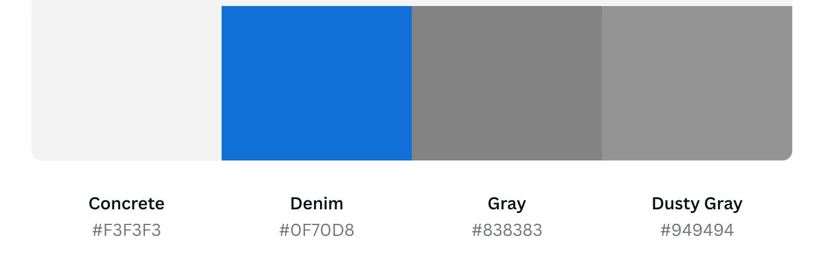
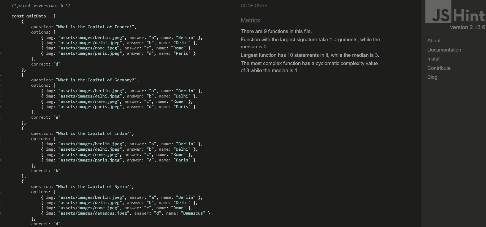

# Capitals of the World - Project Portfolio 1 - HTML & CSS

## Overview

*Capitals of the World* is an interactive quiz application designed to test and improve users' knowledge of world capitals. The quiz presents users with questions where they must identify the capital cities of various countries, with answers represented by images. This engaging and educational tool is perfect for geography enthusiasts, students, or anyone looking to challenge themselves.

The application offers a personalized experience by allowing users to input their name, tracks their score, and provides instant feedback on their answers. With its responsive design, *Capitals of the World* ensures a seamless experience across all devices, from desktops to mobile phones.

You can view the live site here: [Capitals of the World](https://newcoderm.github.io/quiz_capitals-of-the-world/)

## Contents

- [Objective](#objective)
- [User Experience (UX)](#user-experience-ux)
  - [Target Audience](#target-audience)
  - [User Stories](#user-stories)
  - [Site Aims](#site-aims)
- [Design Wireframes](#design-wireframes)
- [Site Structure](#site-structure)
- [Design Choices](#design-choices)
  - [Colour Scheme](#colour-scheme)
  - [Typography](#typography)
- [Features](#features)
  - [Existing Features](#existing-features)
  - [Future Features](#future-features)
- [Technologies Used](#technologies-used)
- [Testing](#testing)
  - [Code Validation](#code-validation)
  - [Lighthouse Testing](#lighthouse-testing)
  - [Accessibility Testing](#accessibility-testing)
  - [Responsive Testing](#responsive-testing)
  - [Manual Testing](#manual-testing)
  - [Bugs Fixed](#bugs-fixed)
- [Deployment](#deployment)
  - [Forking the GitHub Repository](#forking-the-github-repository)
  - [Making a Local Clone](#making-a-local-clone)
- [Credits](#credits)
- [Acknowledgements](#acknowledgements)

## Objective

The aim of this project is to deliver a fun, educational, and interactive quiz that helps users learn about world capitals in an engaging way. The quiz is designed to be user-friendly, accessible, and visually appealing, with the goal of making learning enjoyable.

## User Experience (UX)

### Target Audience

- Geography enthusiasts.
- Students looking to improve their knowledge of world capitals.
- Individuals who enjoy challenging themselves with quizzes.
- Educators looking for a tool to teach students about world geography.

### User Stories

- As a user, I want to easily start the quiz.
- As a user, I want to receive instant feedback on my answers.
- As a user, I want to see my total score at the end of the quiz.
- As a user, I want the quiz to be visually engaging and easy to navigate on any device.

### Site Aims

- To provide a fun and interactive way for users to learn about world capitals.
- To offer a responsive quiz experience that works well on all devices.
- To engage users with visual elements such as images and feedback on their answers.

## Design Wireframes

The design and structure for this quiz were created using Figma. Wireframes were created for both desktop and mobile versions of the site.

## Site Structure

The *Capitals of the World* quiz consists of a single-page application (SPA) structure where users can:

1. Enter their name.
2. Navigate through a series of quiz questions.
3. Receive feedback on their answers.
4. View their final score upon completing the quiz.

## Design Choices

### Colour Scheme

The color palette for *Capitals of the World* is designed to be both engaging and easy on the eyes, with a mix of vibrant and neutral tones to enhance user interaction without overwhelming the senses.

### Typography

The quiz uses a clean and modern sans-serif font to ensure readability across all devices. The font choice aligns with the application's educational purpose, making it accessible to users of all ages.

## Features

### Existing Features

- *Username Input*
  - Users can enter their name before starting the quiz, providing a personalized experience and engagement throughout the quiz.

- *Image-Based Questions*
  - Each quiz question is accompanied by multiple-choice answers, represented as images. This feature enhances user engagement by providing a more interactive and visually appealing quiz experience.

- *Responsive Design*
  - The application is fully responsive, ensuring that it looks and works great on a variety of devices, including desktops, tablets, and mobile phones. This feature allows users to take the quiz on any device, ensuring accessibility and ease of use.

- *Score Tracking*
  - The quiz tracks the user's score, providing instant feedback on whether their answers are correct or incorrect. At the end of the quiz, users can see their total score, making the experience both informative and competitive.

- *Real-Time Feedback*
  - After selecting an answer, users receive immediate feedback indicating whether they were correct. This feature helps users learn and reinforces correct answers instantly.

## Technologies Used

- *HTML5* - Provides the structure and content for the website.
- *CSS3* - Responsible for the styling and layout of the website.
- *JavaScript* - Adds interactivity and handles the quiz logic.
- *Figma* - Used to create the wireframes for the website.
- *GitHub* - Used to host and deploy the website.

## Testing

### Code Validation

The *Capitals of the World* quiz application was tested using HTML and CSS validators.

- *W3C HTML Validator*: No errors were found.

- *W3C CSS Validator*: No errors were found.

- *JShint JS Validator*: No warnings were found.

### Lighthouse Testing

Lighthouse testing was performed using Chrome DevTools, evaluating the site in the following areas:

- *Performance*
- *Accessibility*
- *Best Practices*
- *SEO*

### Accessibility Testing

Accessibility testing ensured that the site is usable by all users, including those with disabilities. Tools like Lighthouse were used to verify compliance with accessibility standards.

### Responsive Testing

The website's responsiveness was tested across various devices using Chrome DevTools and physical devices to ensure it functions well on desktops, tablets, and mobile devices.

### Manual Testing

Manual testing was performed to verify that all features function as expected:

- *Username Input*: Checked for proper functionality and validation.
- *Quiz Flow*: Verified that the quiz flows correctly from one question to the next.
- *Image Selection*: Ensured that image selection works as intended and provides feedback.
- *Score Calculation*: Confirmed that the score is calculated correctly and displayed at the end of the quiz.
- *Responsive Design*: Tested the quiz on various screen sizes to ensure it remains user-friendly.

### Bugs Fixed

- *HTML Validation*: No errors were found.
- *CSS Validation*: No errors were found.

## Deployment

### Steps to Deploy

The *Capitals of the World* quiz application was deployed to GitHub Pages using the following steps:

1. Navigate to the *Settings* tab in the GitHub repository.
2. Scroll down to the *Pages* section.
3. Under the *Source* tab, select the main branch and the root folder.
4. Click *Save*. The site will be deployed, and the link will be displayed.

### Forking the GitHub Repository

To fork the repository:

1. Log in to GitHub and locate the repository.
2. Click the *Fork* button at the top-right of the repository page.

### Making a Local Clone

To clone the repository:

1. Log in to GitHub and locate the repository.
2. Click *Clone or download*.
3. Copy the repository URL.
4. Open Git Bash and navigate to the desired directory.
5. Type git clone, paste the URL, and press Enter.

## Credits

- *Images*: All images used in the quiz were sourced from [Unsplash](https://unsplash.com) and other open-source platforms.
- *CSS Grid Code: Learned from tutorials by **Traversy Media*.
- *JavaScript Logic: Inspired by tutorials from **The Net Ninja* and *Academind*.

## Acknowledgements

This quiz application, *Capitals of the World*, was designed and developed as part of the Full Stack Software Developer Diploma course at the Code Institute. Special thanks to:

- *Spencer Barriball* (Mentor): For valuable advice and guidance.

Thank you to everyone who supported this project! ❤